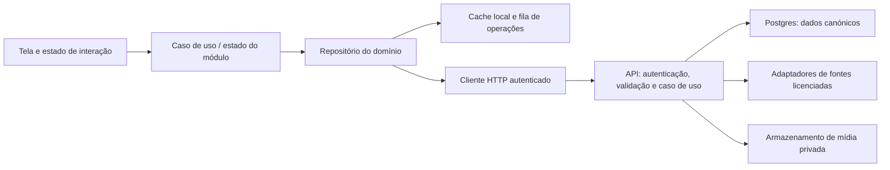

# Arquitetura, persistência e contratos

Base de 17/09/2026, ampliada em 24/09/2026 para [R01–R18](README.md). Direção proposta; não é arquitetura aprovada nem contrato já implementado. O estado atual está na [documentação técnica](../../documentacao-tecnica.md).

## Ponto de partida e direção

Preservar e avaliar o Flutter existente e a API Fastify/Prisma atual antes de decidir uma reescrita. A direção inicial é um backend modular com responsabilidades claras, Postgres e adaptadores para fontes externas; não há necessidade demonstrada de microserviços. A hospedagem deve ser escolhida após uma prova de compatibilidade com runtime, conexões, tarefas e orçamento.

O desenho é conceitual, não descrição da implementação atual. A fila local é para sincronização do aplicativo; trabalhos longos no servidor, se necessários, exigem estratégia própria. Não executar processamento pesado em uma requisição curta apenas por conveniência de hospedagem.

## Domínios a detalhar para a visão integrada

Esta divisão é hipótese de arquitetura para a etapa 6, não nova implementação, schema SQL ou contrato aprovado.

| Responsabilidade | Conceitos e invariantes a especificar |
|---|---|
| Conteúdo e aprendizagem | Fonte, licença por objeto, programa/versão, sessões, exercício/prática, mídia, instrução simples/técnica, tutorial e estado de revisão |
| Contexto e objetivos | Experiência por modalidade, equipamento/local, agenda, metas múltiplas, medidas com data/origem e configuração progressiva por função |
| Planeamento da prática | Programa humano original, cópia personalizada, opções autorizadas, calendário e ocorrência; alterações não herdam aprovação indevidamente |
| Execução multimodal | Sessão e blocos: série/repetição/carga, tempo/distância/ritmo, sequência/posição ou circuito. Não forçar toda modalidade no modelo de musculação |
| Alimentação | Alimento/produto/composição versionados, porção, receita/rendimento, plano alimentar, refeição planeada e consumo real; modelo alimentar não equivale a prescrição individual |
| Captura/conexões | Origem externa, permissões, IDs/intervalos, estado de sincronização; dados manuais, medidos, importados e estimados distintos |
| Imagem e confirmação | Ativo privado, propósito, extração/identificação, candidatos, campos desconhecidos, correção e confirmação. Sugestão não confirmada não vira consumo/atividade definitiva |
| Acompanhamento | Projeções de Hoje/histórico/tendências por objetivo, com completude e origem; atualização incremental a partir de registros canónicos |
| Preferências e proteção | Idioma/unidades/profundidade da linguagem, privacidade, retenção, exclusão, conexão/desconexão e disponibilidade de capacidades |

Programas devem guardar os parâmetros realmente oferecidos pela fonte e suas condições de progressão. Não criar um gerador implícito que preencha doses em falta. Plano próprio e conteúdo do catálogo têm origens/permissões diferentes. Dados de contexto clínico não devem ser usados como se constituíssem avaliação individual.

### Integração entre atividade e alimentação

Objetivos, agenda e histórico conectam os módulos; não precisam de uma chamada externa a cada interação. Separar **planeado de realizado**, ingestão de gasto, energia ativa de total/basal, dados do dispositivo de fórmulas e quantidade declarada de inferida. Definir prioridades por origem e intervalo para não contar a mesma corrida importada e gravada no app duas vezes.

Não alterar a meta alimentar automaticamente ao receber uma atividade. Se houver regra aprovada de ajuste, guardar método/versão, entradas, motivo, limites e consentimento/controle do utilizador. Desconhecido não vira zero; peso isolado não gera uma medida de massa muscular ou gordura.

### Captura por imagem e dados conectados

Foto do prato, código de barras, OCR do rótulo, foto de painel e identificação de movimento têm contratos e requisitos de prova distintos. Se o processamento precisar ser remoto/longo, avaliar operação assíncrona com estado, limite e cancelamento; não assumir que uma função curta na Vercel resolve tudo. Processamento no dispositivo é candidato, sem SDK ou desempenho aprovado.

Guardar separadamente ativo original, resultado sugerido e registro confirmado, com política de eliminação. A imagem não pode autorizar coleta contínua de câmera/localização. Conexões devem tratar revogação, origem/identificador externo, alterações do provedor, exclusão e importações repetidas. Nenhum retorno do provedor deve ser aceito como se tivesse qualidade superior garantida.

## Quatro tipos de estado

| Tipo | Exemplos | Onde e quando preservar |
|---|---|---|
| Interação | Aba, scroll, foco, filtros, modal | Memória/estado de navegação; restauração seletiva. Não enviar tudo ao servidor. |
| Dados partilhados em sessão | Perfil, resumo, plano ativo | Repositórios compartilhados, deduplicação de chamadas e invalidação após alteração |
| Trabalho durável no dispositivo | Sessão ativa, séries, rascunhos, operações pendentes | Armazenamento local transacional; avaliar SQLite/solução equivalente antes de escolher biblioteca |
| Dados canónicos e identidade | Histórico sincronizado, conta, planos e versões | Servidor com ownership e regras; tokens separados em armazenamento seguro do dispositivo |

Cada cache deve incluir utilizador, recurso, parâmetros e versão de esquema. Nunca reutilizar cache privado entre contas. Logout, exclusão e troca de utilizador precisam de política para limpar dados e impedir que operações antigas reapareçam.

## Eliminar recargas desnecessárias

O diagnóstico atual registra que `/mobile/bootstrap` devolve dados de início que não são aproveitados integralmente e que a troca de páginas não tem cache compartilhado. Planejar o reaproveitamento dessa resposta e a preservação de estado da navegação, verificando consumo de memória; não pré-carregar todas as telas, mapas e vídeos.

Proposta: exibir cache e revalidar quando necessário, deduplicar requisições simultâneas do mesmo recurso, cancelar consultas obsoletas e invalidar apenas dados afetados. Concluir treino atualiza sessão, histórico e resumo; não precisa descarregar todo o app. Fotos e mídia devem carregar sob demanda, com cache limitado.

Definir por recurso: prazo de validade, versão, gatilhos de atualização, limite de tamanho e possibilidade de uso sem rede. Como hipótese inicial, resumo pode revalidar após poucos minutos; catálogo muda menos e pode ter janela maior, se a licença permitir. Esses prazos serão medidos e aprovados, não são garantias de dados atuais. Respostas privadas não devem entrar em cache público compartilhado.

## Escrita local e sincronização

1. Validar a ação e gravar dados + operação pendente numa transação local.
2. Mostrar “guardado neste dispositivo” quando ainda não houver confirmação remota.
3. Enviar operação com identidade única e política de repetição limitada.
4. Servidor valida utilizador, versão e invariantes; guarda efeito e resultado idempotente de forma atómica.
5. Aplicativo confirma sincronização ou apresenta conflito/falha com possibilidade de recuperação.

Estados previstos: local, a enviar, sincronizado, erro e conflito. Repetir um pedido após timeout não pode duplicar uma série ou refeição. A chave idempotente deve ser associada a utilizador e conteúdo; não aceitar a mesma chave para payload diferente. Versionamento otimista é candidato para edições concorrentes. A estratégia de conflito deve variar por entidade: acrescentar registro não é igual a substituir um perfil.

Temporizadores usam instante/deadline persistido e recalculam ao voltar ao foreground; não dependem de um contador visual continuar rodando. GPS em background só durante atividade autorizada e conforme limitações do sistema. Guardar dados sensíveis localmente exige avaliar cifragem, backup do sistema, limpeza e retenção.

## Navegação não é endpoint

Uma rota de tela identifica destino e contexto; uma chamada HTTP representa operação de domínio; uma tabela armazena dados segundo invariantes. Não criar uma tabela por tela nem um endpoint por botão sem necessidade.

Exemplo proposto: ao tocar num treino, a navegação recebe `planId`/`sessionId`; o repositório resolve dados locais/remotos. Não passar token, objeto completo desatualizado ou informação sensível em URL de navegação. Links externos devem validar destino e autenticação. IDs de recursos não substituem autorização no servidor.

## Matriz de contratos a produzir após aprovação visual

Os nomes abaixo são casos de uso, não URLs finais. Inventariar os endpoints existentes antes de conservar, adaptar ou versionar caminhos.

| Origem / ação | Dados enviados | Resposta necessária | Persistência e falhas a especificar |
|---|---|---|---|
| Login / entrar | Credencial do fluxo escolhido, por canal seguro | Sessão, perfil mínimo, estado de configuração | Tokens seguros; cancelamento, credencial inválida, refresh e sessão revogada |
| Configuração / guardar | Campos preenchidos, unidade, versão | Perfil normalizado e capacidades disponíveis | Perfil + status por módulo; erro por campo, concorrência |
| Plano / abrir | ID e, quando aplicável, versão | Exercícios, ordem, séries propostas, autoria e mídia | Cache permitido; fonte ausente, versão retirada |
| Treino / registar série | Sessão, exercício, série, carga/repetições/unidades, instante, operação | Registro confirmado e versão | Escrita local + sincronização; duplicação/conflito |
| Treino / concluir | Sessão, estado parcial/completo, instantes | Resumo e estado final | Histórico preservado; conclusão repetida/concorrente |
| Diário / adicionar | Alimento/fonte, quantidade, unidade, refeição/data | Registro e nutrientes normalizados | Snapshot da composição; porção inválida, nutrientes desconhecidos |
| Captura / reconhecer ou extrair | Propósito, ativo e dados permitidos; operação própria | Candidatos/campos, estado, limites e confirmação necessária | Ativo privado; cancelamento, falha, resultado errado, quantidade desconhecida |
| Captura / confirmar | Resultado revisto, quantidade/unidade e origem | Registro de refeição/atividade e versão | Não duplicar confirmação nem esconder valores corrigidos |
| Conexão / importar | Fonte, escopo consentido, intervalo/identificadores | Registros normalizados, conflitos/duplicados | Revogação, paginação, deduplicação, exclusão e repetição |
| Plano alimentar / guardar | Rotina, refeições/itens, versão e origem | Plano organizado com campos pendentes/limites | Planeado separado de consumo; alteração de receita/meta não reescreve histórico |
| Aprendizagem / consultar | Tarefa, idioma e nível de explicação | Conteúdo versionado e mídia permitida | Cache elegível; ausência de tradução/mídia; retorno à edição |
| Atividade / terminar | Tipo, instantes, métricas e percurso quando autorizado | Atividade guardada, métricas aceites | Pontos/arquivo e resumo; GPS incompleto, limites de payload |
| Dashboard / consultar | Período e fuso, filtros | Métricas definidas, unidades e completude | Derivação de histórico; vazio diferente de falha |
| Perfil / exportar ou excluir | Pedido autenticado e confirmação exigida | Estado da operação e próximo passo | Retenção, revogação, mídia, fornecedores e operações pendentes |

Para cada linha completar: ID do controle no Figma, rota do app, pré-condições, endpoint/método, DTO, status, side effects, autorização, idempotência, cache e teste. Cabeçalho não deve carregar dados de perfil que pertencem ao body.

## HTTP, OpenAPI e Swagger

Definir uma fonte de verdade para schemas de entrada/saída, alinhada à validação do servidor. Gerar e validar OpenAPI; Swagger UI apresenta o contrato, mas não substitui testes. Clientes gerados devem vir desse contrato e não receber ajustes manuais.

| Item | Proposta a confirmar com API existente |
|---|---|
| Autenticação | Bearer nos endpoints privados; refresh separado; nunca registrar credenciais em logs |
| Formato | `Accept` e `Content-Type` coerentes; uploads têm contrato próprio |
| Rastreamento | Identificador de requisição na resposta/log sem dados sensíveis |
| Escritas repetíveis | Chave de idempotência nas operações que podem ser repetidas; escopo e expiração definidos |
| Concorrência | Versão ou ETag/If-Match quando aplicável; conflito explícito |
| Cache | Revalidação condicional para recursos elegíveis; regras privadas/públicas separadas |
| Falhas | Código estável, mensagem apresentável, erros por campo, request ID e indicação de repetição quando segura |
| Limites | Paginação, tamanho de payload, timeout e `Retry-After` quando aplicável |

Documentar respostas de sucesso e 400/401/403/404/409/422/429/5xx conforme convenção aprovada; não usar todas indiscriminadamente. Distinguir sem acesso de recurso inexistente conforme política de segurança. OpenAPI deve conter exemplos fictícios, campos obrigatórios/opcionais, enums, nulos, unidades e mudanças compatíveis.

Guardar instantes em UTC e manter contexto de data local/fuso IANA quando o domínio exige. `Europe/Lisbon` não é um offset fixo. Separar idioma de unidade, gramas de mililitros e valor desconhecido de zero. Conversão volume/massa exige densidade adequada; não assumir 1 ml = 1 g para todo alimento.

## Banco: primeiro invariantes, depois tabelas

Domínios candidatos: conta/sessões de autenticação, perfil e preferências, configurações por módulo, catálogo de exercícios e fontes, plano e versão, agendamento, sessão e séries realizadas, atividade/percurso, alimento e composição, refeição/itens, ativos de mídia e operações idempotentes. São conceitos, não uma migration pronta.

Preservar snapshots/versionamento do plano executado e da composição usada na refeição: atualizar catálogo não pode reescrever histórico. Conclusão deve pertencer à ocorrência da sessão, não bloquear para sempre um dia da semana. Histórico não depende apenas do plano atualmente ativo.

Definir ownership, unicidade, chaves estrangeiras, índices e transações a partir das consultas/concorrência. Separar arquivos de mídia do Postgres, mantendo metadados e permissões no banco. Definir eliminação/anonimização, retenção, exclusão de mídia e restauração antes de aplicar migrações. A base local e a remota têm modelos e migrações próprios.

## Decisões técnicas que ainda faltam

Rever bibliotecas/lockfiles, soluções de estado/rotas, base local, conectividade, mapas, upload, crash reporting e compatibilidade iOS 26. Escolher somente após critérios de manutenção, licença, tamanho, desempenho e provas necessárias. Planejar limites de conexão/pooling Postgres, retomada do banco, rate limiting distribuído e processos longos segundo o host escolhido. Nenhuma troca de stack foi decidida nesta entrega.
