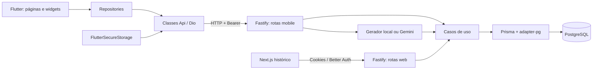
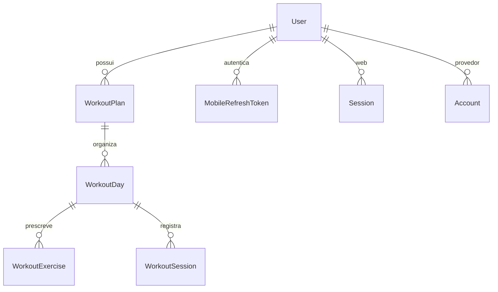

# TrainForge — documentação técnica do estado atual

**Contexto de 24/09/2026:** este documento preserva o inventário do código existente. A visão futura está em [R01–R18](docs/planejamento/README.md) e as hipóteses de evolução em [arquitetura/contratos](docs/planejamento/arquitetura-e-contratos.md). O app ainda não implementa o produto integrado, sensores/imagens ou alimentação guiada. Nenhuma mudança de lógica, contrato ou banco foi feita nesta revisão documental.

Data: 09/09/2026. Fonte principal: arquivos locais e verificações descritas em [validação](docs/validacao.md). Esta documentação descreve implementação, não aprovação de arquitetura futura.

## 1. Arquitetura existente

**Localização:** Flutter em `C:\dev\TrainForge\trainforge`; todo o Fastify/Prisma acima em `C:\dev\bootcamp-treinos-api`. Não há servidor nem schema Prisma dentro do app. O projeto web fica em `C:\dev\bootcamp-treinos-frontend`.

## 2. Stack observada

| Camada | Dependências declaradas relevantes |
| --- | --- |
| Flutter | Dart `^3.11.1`; Dio `^5.9.2`; flutter_secure_storage `^10.0.0`; google_sign_in `^7.2.0`; flutter_lints `^6.0.0` |
| API | Node 24; pnpm 10.30.0; TypeScript 5.9.3; Fastify 5.7.4; Prisma/client/adapter-pg 7.4.0; Zod 4.3.6 |
| Autenticação | Better Auth 1.4.18 na web; google-auth-library `^10.6.1` e jsonwebtoken `^9.0.3` no mobile |
| IA ainda instalada | AI SDK 6.0.100; adaptadores Google 3.0.34 e OpenAI 3.0.33 |
| Web histórico | Next 16.1.6; React/React DOM 19.2.3; Tailwind 4; Orval 8.1.0; AI SDK React 3.0.51 |

São versões declaradas, não uma recomendação de upgrade nem auditoria de vulnerabilidades. Intervalos `^` podem resolver versões diferentes; consultar `pubspec.lock`/`pnpm-lock.yaml`. Revisão de atualidade e troca de bibliotecas são fase 3.

## 3. Estrutura Flutter e pontos de entrada

| Caminho relativo ao app | Responsabilidade |
| --- | --- |
| `lib/main.dart`, `lib/app.dart` | Inicialização; MaterialApp; tema Material 3 azul |
| `lib/core/config/app_config.dart` | URL fixa `http://127.0.0.1:8081` |
| `lib/core/http/app_dio.dart` | Dio singleton; token Bearer; timeouts e logs |
| `lib/core/log/app_logger.dart` | `developer.log` e `debugPrint` em debug |
| `lib/shared/widgets/auth_gate.dart` | Token → bootstrap → autenticação/onboarding/AppShell |
| `lib/shared/widgets/app_shell.dart` | Quatro abas: início, treinos, estatísticas e perfil |
| `lib/features/auth/` | Google Sign-In, troca de token, secure storage, tela de entrada |
| `lib/features/bootstrap/` | Modelo do bootstrap e acesso à API |
| `lib/features/home/` | Resumo do dia e consistência |
| `lib/features/onboarding/` | Escolha manual/IA, dados físicos e preferências |
| `lib/features/workouts/` | Lista de planos, detalhe, exercícios, início/fim de sessão |
| `lib/features/profile/` | Perfil e alteração dos dados físicos |
| `lib/features/stats/` | Estatísticas por intervalo |
| `android/`, `ios/`, `web/`, `windows/`, `linux/`, `macos/` | Scaffolds de plataforma; presença não prova suporte funcional |

Cada feature tende a separar `data`, `domain` e `presentation/pages`. Repositories repassam a maior parte das chamadas às classes Api; não implementam cache ou persistência de treinos. Páginas StatefulWidget controlam loading, erro, navegação e chamadas diretamente. Objetos são instanciados nas próprias classes; não há composição com injeção de dependência central.

## 4. Fluxos de execução

### Login e sessão

1. `AuthRepository.signInWithGoogle()` inicializa GoogleSignIn e obtém um Google ID token. O client ID nativo está fixado no Dart; é identificador público, não segredo, mas precisa variar por ambiente/aplicação.
2. `AuthApi.loginWithGoogleIdToken()` chama `POST /mobile-auth/google`.
3. A API verifica o token com Google, valida audiência e email verificado, faz upsert de `User` pelo email, assina JWT HS256 e cria refresh token aleatório de 48 bytes.
4. Só o hash SHA-256 do refresh token é guardado no banco. A resposta contém `token`, `refreshToken` e `user`.
5. **O Flutter ignora `refreshToken`**: `AuthUser` só lê `token`; `AuthStorage` só guarda `auth_token`.
6. Dio lê o token do secure storage para cada requisição. Em 401, páginas normalmente limpam a sessão e regressam ao login.
7. Logout do app apaga o token local e encerra GoogleSignIn; não chama `/mobile-auth/logout`.

O servidor possui renovação e revogação; o cliente não as utiliza. O JWT de acesso tem duração padrão de 7 dias, refresh de 30 dias. Revogar refresh não invalida automaticamente um JWT de acesso já emitido.

### Entrada e desempenho

`main → TrainForgeApp → AuthGate → BootstrapRepository → /mobile/bootstrap`.

O bootstrap autentica, lê home e dados físicos em paralelo, calcula `hasActivePlan` e `needsOnboarding = !hasActivePlan || !trainData`. `GetUserTrainData` retorna null se qualquer um dos quatro campos físicos faltar.

`AuthGate` usa apenas a decisão de onboarding e abre `AppShell()` sem entregar `bootstrap.homeData`. `HomePage.initState` chama novamente `/mobile/home/:date`. Há duplicação comprovada de carregamento; a economia que motivou o bootstrap não foi aproveitada integralmente no app.

`AppShell` usa `body: pages[currentIndex]`. Ao trocar páginas de tipos diferentes, o estado pode ser descartado; voltar à aba dispara nova inicialização/carregamento. Não há base offline para abrir treino sem rede. Não foram medidos tempos em aparelho nem latências do deploy antigo.

### Criação de plano

Manual: formulário → `OnboardingApi.createManualPlan` → `/mobile/onboarding/manual-plan` → autenticação → lock em `Set` local → `UpsertUserTrainData` → `buildManualWorkoutPlan` → `CreateWorkoutPlan`.

- Recebe dados físicos, objetivo, 1–6 dias, experiência, duração e restrições.
- O gerador usa só objetivo, dias, experiência e duração. Restrições não entram no gerador; os dados físicos apenas são guardados.
- Modelos de exercícios e dias estão escritos em `src/lib/manual-plan-builder.ts`; não vêm de API pública/documento externo.
- A duração declarada é `sessionDurationInMinutes * 60`; alterar esse número não adapta o conteúdo à duração.
- Séries, repetições e pausas são atribuídas por regras gerais; não há autoria, revisão profissional nem proveniência.

IA: formulário → `/mobile/onboarding/ai-plan` → `generateObject` com Gemini → schema → `CreateWorkoutPlan`. Dio aumenta o timeout de recebimento a 90 s nessa chamada. A rota web `/ai` mantém o chat com ferramentas. A validação de formato não comprova adequação individual de um treino.

`CreateWorkoutPlan` valida sete dias únicos, descanso sem exercícios/duração, ordem sequencial e números positivos. Usa transação Serializable, comparação de equivalência para reutilizar o plano ativo igual, desativação dos ativos e criação aninhada de dias/exercícios. Os dados físicos são salvos antes dessa transação; uma falha na criação pode deixar o perfil atualizado sem plano novo.

### Sessão de treino

Lista → detalhe do plano → `WorkoutDayPage` → início → nova consulta do dia → conclusão → nova consulta do dia.

`StartWorkoutSession` verifica proprietário e plano ativo, bloqueia o WorkoutDay com `FOR UPDATE`, rejeita descanso/sessão aberta e cria a sessão com hora do servidor. `UpdateWorkoutSession` verifica a cadeia proprietário/plano/dia/sessão, bloqueia a sessão, rejeita conclusão duplicada, fim anterior ao início e fim mais de 5 minutos no futuro.

**Defeito de recorrência:** `GetWorkoutDay` devolve todas as sessões daquele dia do plano; `hasCompletedSession` do Flutter retorna true se qualquer uma estiver concluída, sem filtrar a data. O botão de iniciar fica desabilitado depois da primeira conclusão, inclusive numa semana seguinte.

Não existem registos por série, carga, repetição efetiva, RPE, pausa de sessão ou cronómetro persistido. Fechar uma sessão horas depois inclui esse intervalo inteiro nas estatísticas.

## 5. Contratos HTTP atuais

Prefixos vêm de `src/index.ts`; caminhos internos vêm de `src/routes/`. A autenticação mobile usa Bearer; web usa sessão Better Auth. A tabela normaliza as rotas de coleção sem barra final — o comportamento de trailing slash deve ser confirmado no teste integrado.

| Método e rota mobile | Função | Consumida pelo Flutter |
| --- | --- | --- |
| `POST /mobile-auth/google` | Google ID token → tokens e utilizador | Sim |
| `POST /mobile-auth/refresh` | Rotaciona refresh token | Não |
| `POST /mobile-auth/logout` | Revoga refresh token fornecido | Não |
| `GET /mobile-auth/me` | Identidade autenticada | Método existente em AuthApi |
| `GET /mobile/bootstrap` | Utilizador, home, dados físicos, flags | Sim |
| `GET /mobile/home/:date` | Dia ISO `YYYY-MM-DD` | Sim |
| `GET /mobile/profile` | Utilizador + dados físicos | Sim |
| `PUT /mobile/profile/train-data` | Atualiza quatro campos físicos | Sim |
| `GET /mobile/stats?from=...&to=...` | Estatísticas do plano ativo | Sim |
| `POST /mobile/onboarding/manual-plan` | Geração local | Sim |
| `POST /mobile/onboarding/ai-plan` | Geração Gemini | Sim |
| `GET /mobile/workout-plans?active=true` | Lista planos | Sim |
| `POST /mobile/workout-plans` | Cria plano com estrutura fornecida | Não há editor equivalente no app |
| `GET /mobile/workout-plans/:workoutPlanId` | Plano e dias | Sim |
| `GET /mobile/workout-plans/:workoutPlanId/days/:workoutDayId` | Exercícios e sessões | Sim |
| `POST /mobile/workout-plans/:workoutPlanId/days/:workoutDayId/sessions` | Inicia sessão | Sim |
| `PATCH /mobile/workout-plans/:workoutPlanId/days/:workoutDayId/sessions/:sessionId` | Conclui com `completedAt` | Sim |

Rotas web equivalentes: `GET /bootstrap`, `GET /home/:date`, `GET/PUT /me`, `GET /stats`, `POST /ai`, `GET/POST /workout-plans`, detalhes de plano/dia e criação/atualização de sessão sob `/workout-plans`. Há também `/api/auth/*` (Better Auth), `GET /` e `/swagger.json`/referência interativa em desenvolvimento. Não há endpoints de corrida, alimentos ou anúncios.

Formas importantes: o início retorna `userWorkoutSessionId`; a conclusão recebe e retorna `completedAt`; no banco o campo chama-se **`completeAt`**. Não renomear só um lado. Medidas: peso inteiro em gramas, altura em centímetros, duração em segundos, gordura corporal inteira. `conclusionRate` é fração entre 0 e 1.

## 6. Banco de dados

`Verification` é outra tabela do sistema de autenticação. `WorkoutSession` não tem `userId` próprio: o proprietário é obtido via dia → plano → utilizador. Essa é uma diferença em relação ao diagrama inicial do FIT.AI, que mostrava `UserWorkoutSession` com `userId` direto. O schema local é a fonte de verdade atual.

Planos, dias, exercícios e sessões usam UUID, timestamps e deleção em cascata. `User` tem email único e dados físicos opcionais; `WorkoutPlan` tem `isActive`; `WorkoutDay` é único por plano/dia da semana; `WorkoutExercise` é único por dia/ordem. Sessão tem início obrigatório e fim nullable. Refresh tokens guardam hash, validade, revogação e metadados.

**Migrations, na ordem:**

1. `20260311181304_init`
2. `20260320220717_ajuste_em_erros_do_codigo`
3. `20260321144035_add_mobile_refresh_tokens_and_hardening`
4. `20260321144100_add_partial_unique_indexes`
5. `20260321144259_partialunique`

A quarta cria índices parciais de um plano ativo por utilizador, uma sessão aberta por dia e refresh ativo. **A quinta remove exatamente os três índices.** Portanto, aplicar a sequência inteira não mantém essas garantias no banco. Não confundir intenção de uma migration anterior com estado final. Transações/locks continuam existindo, mas não substituem essa constatação. O banco em execução não foi consultado; não sabemos quais migrations estão aplicadas nele.

O modelo é centrado numa semana fixa de musculação. Não possui entidades para catálogo/autor/licença/versão do conteúdo, programa público versus plano do utilizador, execução por série, histórico corporal, alimentação, GPS, metas por modalidade ou sincronização. Esses conceitos precisam de desenho na fase 3, sem simplesmente acrescentar tudo a `WorkoutExercise`.

## 7. Estatísticas e tempo

`GetStats` seleciona o plano ativo mais recente, limita o intervalo a uma diferença de até 366 dias e agrupa sessões pela data UTC de início. Taxa de conclusão = sessões concluídas / sessões iniciadas; não mede adesão ao plano programado. Tempo = soma de fim − início das concluídas.

Trocar o plano ativo muda o conjunto de sessões usado; o histórico anterior continua no banco, mas sai dessas métricas. `calculateWorkoutStreak` retrocede até 365 dias, soma também descanso e interrompe ao encontrar treino não concluído. Hoje ainda não concluído pode zerar a sequência logo cedo; dias de descanso podem gerar contagem sem execução. A semântica deve ser definida antes de exibir isso como evolução.

App e backend usam UTC para o dia. Portugal continental tem horário de verão: o dia percebido pelo utilizador pode divergir perto da meia-noite. Fuso do utilizador, início da semana e treino atravessando o dia precisam ser explicitamente decididos e testados.

## 8. Ambiente da API

Nomes e padrões lidos em `src/lib/env.ts`; valores privados não foram copiados.

| Variável | Obrigatoriedade/padrão | Uso |
| --- | --- | --- |
| `DATABASE_URL` | Obrigatória; prefixo `postgresql://` | Prisma/adapter-pg |
| `PORT` | 8080 | Porta do servidor; para o Flutter local, configurar 8081 |
| `NODE_ENV` | development | Logs e documentação |
| `API_BASE_URL` | localhost:8081 | Better Auth/OpenAPI |
| `WEB_APP_BASE_URL` | localhost:3000 | Origem web |
| `TRUSTED_ORIGINS` | Vazia | Lista separada por vírgula |
| `COOKIE_DOMAIN` | Opcional | Cookies entre subdomínios |
| `BETTER_AUTH_SECRET` | Obrigatória | Sessão web |
| `GOOGLE_CLIENT_ID`, `GOOGLE_CLIENT_SECRET` | Obrigatórias | OAuth web |
| `GOOGLE_GENERATIVE_AI_API_KEY` | Obrigatória atualmente | IA; impede inicialização sem chave mesmo no fluxo manual |
| `OPENAI_API_KEY` | Opcional | Integração de IA legada |
| `MOBILE_GOOGLE_CLIENT_IDS` | Obrigatória | Audiências Google permitidas |
| `MOBILE_JWT_SECRET` | Obrigatória, mínimo 32 caracteres | Assinatura JWT |
| `MOBILE_ACCESS_TOKEN_TTL` | 7d | JWT de acesso |
| `MOBILE_REFRESH_TOKEN_TTL_DAYS` | 30 | Refresh token |
| `RATE_LIMIT_GLOBAL_MAX/TIME_WINDOW` | 200 / 1 minute | Defaults; `global:false` não aplica a todas as rotas |
| `RATE_LIMIT_LOGIN_MAX/TIME_WINDOW` | 6 / 1 minute | Login |
| `RATE_LIMIT_REFRESH_MAX/TIME_WINDOW` | 20 / 1 minute | Refresh/logout |
| `RATE_LIMIT_MANUAL_PLAN_MAX/TIME_WINDOW` | 8 / 10 minutes | Geração local |
| `RATE_LIMIT_AI_PLAN_MAX/TIME_WINDOW` | 4 / 15 minutes | Geração IA |

Em cada par de rate limit, o prefixo completo repete-se nas duas variáveis (ex.: `RATE_LIMIT_LOGIN_MAX` e `RATE_LIMIT_LOGIN_TIME_WINDOW`).

## 9. Operação e manutenção

- API: `pnpm dev`; `pnpm build` gera Prisma e transpila; `pnpm start` executa `dist/index.js`.
- Dockerfile tem estágios de dependências/build/produção. Compose só define PostgreSQL. A imagem não foi construída nesta etapa.
- Fastify configura CORS, headers, request IDs, Zod, logs e limites em rotas específicas. O limite por IP usa diretamente `x-forwarded-for`; confiança no proxy precisa ser delimitada no deploy.
- Locks de criação em `Set` e armazenamento padrão do rate limiter são por processo. Não são garantias globais entre instâncias.
- Prisma usa `PrismaPg` com `DATABASE_URL`; conexão Neon, pool, região e migrations ainda não configurados/validados para o novo produto.
- No Android, `applicationId` é `com.example.trainforge`, release assina com chave debug e o manifest principal não declara INTERNET (debug/profile têm configuração própria). São bloqueadores de release a tratar depois. [Guia Flutter Android](https://docs.flutter.dev/deployment/android).
- O fluxo Google usa `authenticate()`; a existência de `web/` não comprova que o login web funciona. Validar por plataforma e pela documentação da versão escolhida.
- Código gerado Prisma e cliente HTTP Orval não devem ser alterados manualmente. Migrations já utilizadas exigem nova migration corretiva, não edição retroativa sem conhecer os bancos.

## 10. Consulta eficiente por agentes

Leia o [guia](guia-do-projeto.md), depois o trecho relevante deste documento. Use [Graphify](docs/graphify.md) para localizar classes e vizinhanças; confirme o comportamento nos arquivos fonte antes de editar. O grafo principal tem raiz em `lib/`, logo `features/...` no grafo corresponde a `lib/features/...` no app. Os grafos dos projetos históricos estão separados para evitar misturar nomes iguais.

Não tratar código proposto no Figma como funcionalidade já implementada. Não pressupor que o backend foi transferido para esta pasta. Não executar reset do banco, ativar IA, publicar ou atualizar dependências como parte de uma simples retomada.
